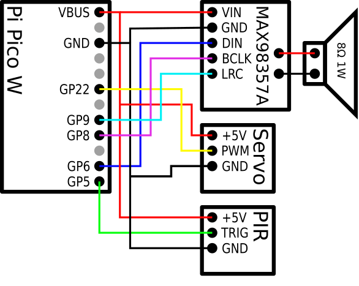

# BooBox
A fun Raspberry Pi Pico W project that combines a few pieces of hardware to create an motion-activated talking skull.

Whenever the motion detector triggers The Pico fetches a sound from the provided TCP server and plays it through the speaker. The jaw matches the audio using a tiny servo that pushes down on a piston that rests on whatever surface the skull is placed on. The skull / Pico W is powered using an ordinary phone charger and a micro USB cable.

DISCLAIMER! I plan on making a much more thorough explanation on how to built your own BooBox when I get the time. For now, what follows is a quick and dirty walkthrough that should provide all necessary information although in a pretty basic and non-visual way.

NOTE! All sounds added to the BooBox server `data` folder MUST be 11KHz 8 bit unsigned! Due to memory limitations of the Raspberry Pi Pico the duration of the sounds must also be less than about 5 seconds (thereabout).

Here's an example of a BooBox I made looking like the fiendlishly funny "Murray the Demonic Talking Skull" from the Monkey Island games:

[](https://www.youtube.com/watch?v=7ivf-3M5PTc)

## What you need

### Hardware
* Raspberry Pi Pico W
* Tiny speaker (I use an 8 Ohm, 1 W)
* PIR HC-SR501 motion sensor
* SG90 / Micro Servo 9g servo motor
* MAX98357A class C I2S amplifier module

#### Electronic schematics


### Software
* The official Pico SDK configured and working (https://github.com/raspberrypi/pico-sdk)
  * Quite easy to get working on a standard Ubuntu machine. Just follow their readme.
* The Qt5 open source SDK
  * On Ubuntu simply run: 'sudo apt-get install qtbase5-dev qtchooser qt5-qmake qtbase5-dev-tools'
* The code from this repository

### 3D models / components
All required 3D models are available in the [3D models](3d_models) subdirectory.

## Building and running
### Server daemon
```
$ cd server
$ qmake
$ make
```
Put your wav files in the `data` directory. Format MUST be mono 11KHz 8 bit unsigned. Now run the server with:
```
$ ./BooBox
```
### Pico client
* Compile the pico_murray client
```
$ cd pico_murray
$ mkdir build
$ cd build
$ cmake -DPICO_BOARD="pico_w" -DWIFI_SSID="SSID" -DWIFI_PASSWORD="PASS" -DTCP_SERVER_IP="SERVERIP" -DTCP_SERVER_PORT="SERVERPORT" ..
$ make
```
* Hold down the 'reprogram' button on the pico and connect the USB cable to the PC, then let go of the button to put the Pico into mass storage mode.
* Drag-n-drop the `pico_murray.uf2` file onto the Pico mass storage device.

If the server is running, everything is hooked up correctly and you've entered your wifi information and IP, your BooBox should now come to life!
